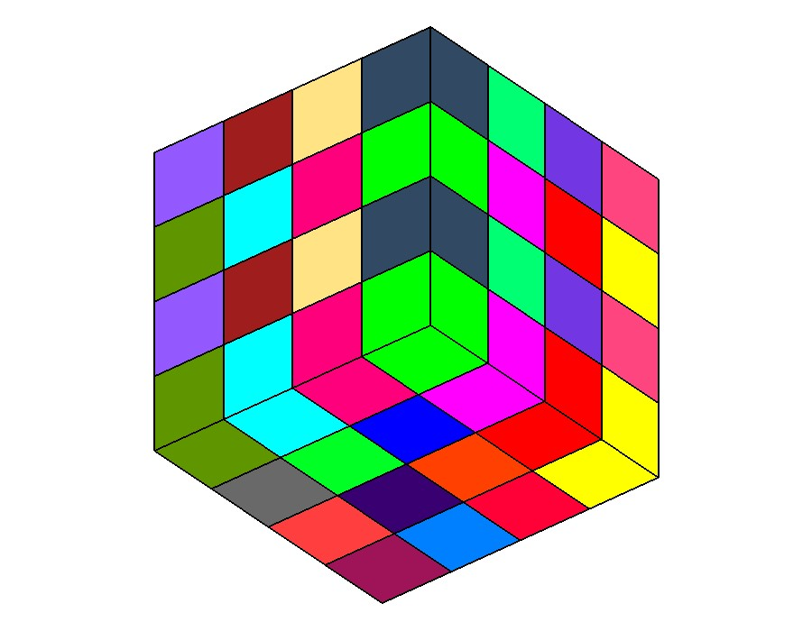
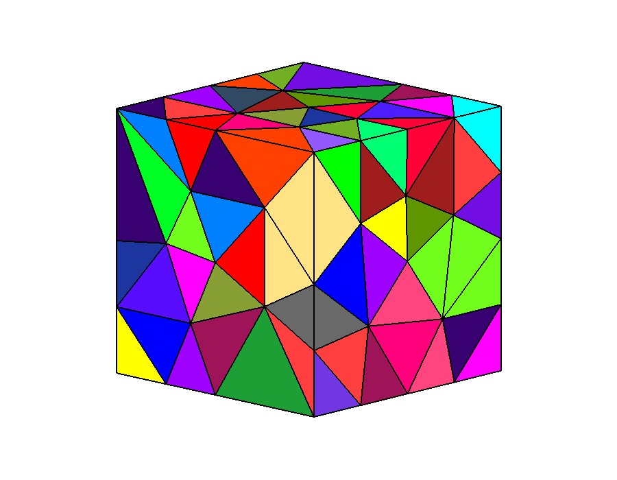
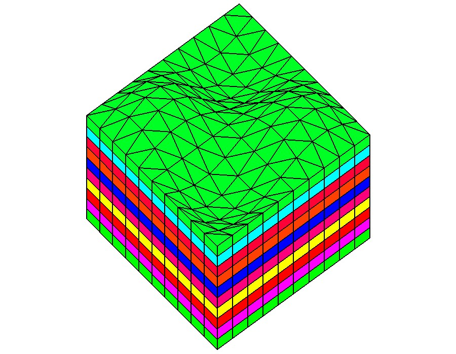

# Benchmark on finite volume schemes for incompressible flows 

## The three families of meshes

### Hexahedra

### Tetrahedra

### Prisms with triangle bases

##  The format of the 3D meshes

We provide one format for the meshes

 `*.typ3`

### Format .typ3

Each file contains the following informations:

*  three lines of comments on the mesh (its description, its creator, ...)
*  the keyword `Version`
*  the version number
*  the keyword `Mesh name`
*  the name of the mesh
*  the keyword `Information on the mesh`
*  the keyword `Number of vertices`
*  the total number of vertices
*  the keyword `Number of control volume`
*  the total number of control volumes
*  the keyword `Number of faces`
*  the total number of faces
*  the keyword `Number of edges`
*  the total number of edges
*  the keyword `Vertices` *followed by* the number of total vertices
*  one line for each vertex that contains the three coordinates of the vertex
*  the keyword `Volumes->faces` *followed by* the number of total volumes
*  one line for each volume that contains a list of `N` integers:
   * The first one is the number of faces belonging to the current volume. It should be equal to `N-1`
   * The last `N-1` integers are the numbers of the faces for the current volume
*  the keyword `Volumes->Vertices` *followed by* the number of total volumes
*  one line for each volume that contains a list of `N` integers:
   * The first one is the number of vertices belonging to the current volume. It should be equal to `N-1`
   * The last `N-1` integers are the numbers of the vertices for the current volume
*  the keyword `Faces->Edges` *followed by* the number of total faces
*  one line for each face that contains a list of `N` integers:
   * The first one is the number of edges belonging to the current face. It should be equal to `N-1`
   * The last `N-1` integers are the numbers of the edges for the current face
*  the keyword `Faces->Vertices` *followed by* the number of total faces
*  one line for each face that contains a list of `N` integers:
   * The first one is the number of vertices belonging to the current face. It should be equal to `N-1`
   * The last `N-1` integers are the numbers of the vertices for the current face
*  the keyword `Faces->Control volumes` *followed by* the number of total faces
   * one line for each face containing the two numbers of the neighboring control volumes that share this face. The second number is conventionally set to `-1` for boundary faces.
*  the keyword `Edges` *followed by* the number of total edges
   * one line for each edge containing the two numbers of its two vertices
 

*******************************************************************************
 
### Example 

An example of a tetrahedral mesh of the unit cube

The corresponding file **`tet.00.typ3`** is	(we skip some lines by writing `......`)

	Mesh generated by tetgen
	translated in this format by F. Hubert
	
	Version
	1
	Mesh name
	tet.00
	Information on the mesh
	Number of vertices
          26
	Number of control volume
          44
	Number of faces
         112
	Number of faces
          93
	Vertices          26
	0.000000000000000E+000  0.000000000000000E+000  0.000000000000000E+000
	1.00000000000000      0.000000000000000E+000  0.000000000000000E+000
	1.00000000000000        1.00000000000000       0.000000000000000E+000
	0.000000000000000E+000   1.00000000000000       0.000000000000000E+000
	0.000000000000000E+000  0.000000000000000E+000   1.00000000000000
	    ......
	Volumes->faces          44
           4          39          40          41          83
           4           8          10          11          51
           4          81          82          83          96
           4          35          36          38          70
	    ......
	Volumes->Vertices          44
           4          15          19           7          24
           4           2           9          13          18
           4          19          15          18          24
           4           6          12          19          18
	    ......
	Faces->Edges          112
           3           1           3          39
           3           1           5          41
           3           2           3          43
           3           2           4          44
	    ......
	Faces->Vertices         112
           3           1           9          17
           3           1           9          23
           3           1          10          17
           3           1          10          21
	    ......
	Faces->Control volumes         112
          19          -1
          19          -1
           8          30
           8          19
	    ......
	Edges          93
           1           9
           1          10
           1          17
           1          21
	    ......

	
